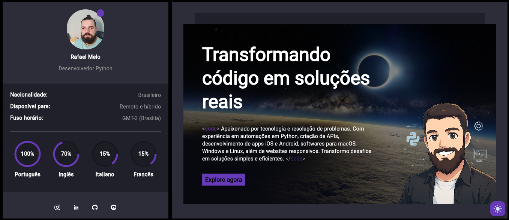

# 🚀 Rafael Melo's Portfolio

Welcome to my portfolio, developed with [Flet](https://flet.dev) — a modern Python framework for building web, desktop, and mobile apps from a single codebase.



---

## 🧑‍💻 About Me

I'm a Python developer passionate about **automation**, **API development**, and **cross-platform solutions**. I focus on turning complex challenges into efficient and elegant results.

**Main skills and interests:**

- Python (Flet, FastAPI, Django, Flask)
- RESTful API development
- SQL and NoSQL databases
- Web scraping and process automation
- Linux and Docker
- Responsive apps for Windows, macOS, Linux, iOS & Android

---

## 🧰 Tech Stack

| Category       | Technologies                                                              |
|----------------|---------------------------------------------------------------------------|
| **Frontend**    | Flet, HTML, CSS                                                           |
| **Backend**     | Python, FastAPI, Django, Flask, REST APIs                                 |
| **Databases**   | PostgreSQL, SQLite, SQLAlchemy, MongoDB                                   |
| **DevOps**      | Docker, Git/GitHub                                                        |
| **Other Tools** | Pytest, Selenium, Requests, Pandas                                        |

---

## 📁 Project Structure

```bash
.
├── assets/                 # Static files, images, icons
├── components/             # Reusable UI components (skills, testimonials, etc.)
├── partials/               # Main UI sections (sidebar, content)
├── storage/                # Local data or temporary storage
├── main.py                 # App entry point
├── pyproject.toml          # Dependency management with Poetry
└── README.md               # This file
```

## 🌗 Light/Dark Theme Switch

This portfolio includes support for dark and light themes, switchable manually or automatically based on screen size.

## 🧪 Run the Project Locally

You can clone and run the project with:
```bash
git clone https://github.com/Rafael-Melo/portfolio.git
cd portfolio
poetry install
poetry run python src/main.py
```

## 📌 License

Distributed under the [MIT](LICENSE). See LICENSE for more information.

Made with 💻, ☕ and 💙 by Rafael Melo — Turning code into real-world solutions
